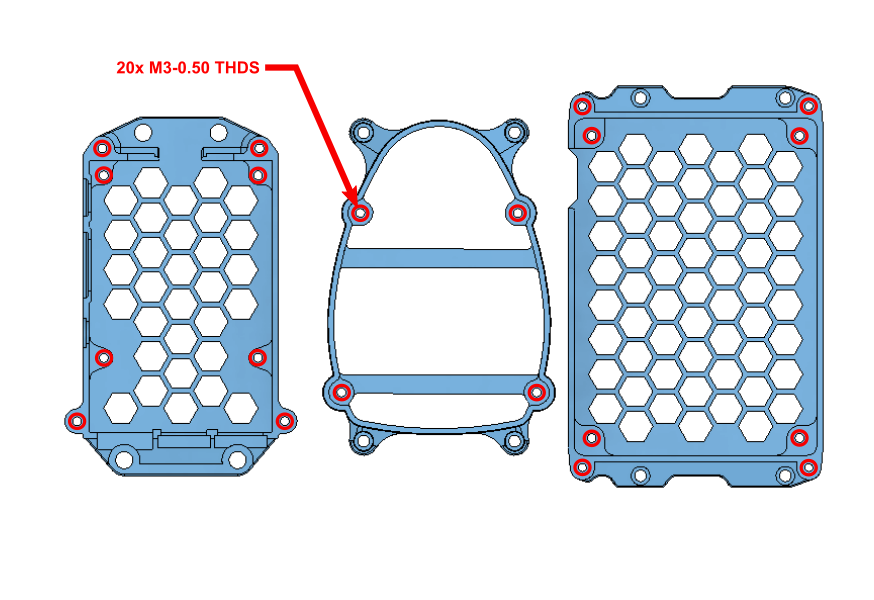

## 3D Printing/Post Processing Instructions

The LEONARDO upgrade kit requires **1** print of each part contained within this sub folder. The parts have been designed to be easily printable on any FDM type printer.

Once printed several holes on Parts No. **01**, **02**, and **04** require **tapping**, an **M3-0.5** tap is required for this process. The **RED** circles in the image below indicate the relevant holes that require tapping on each part.

