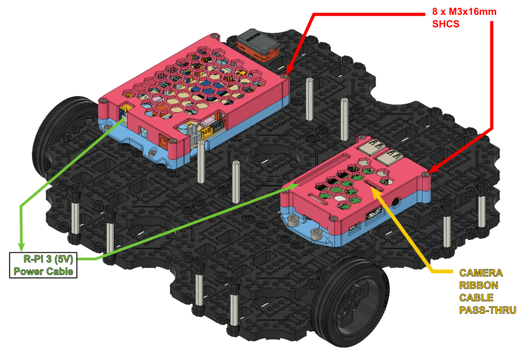
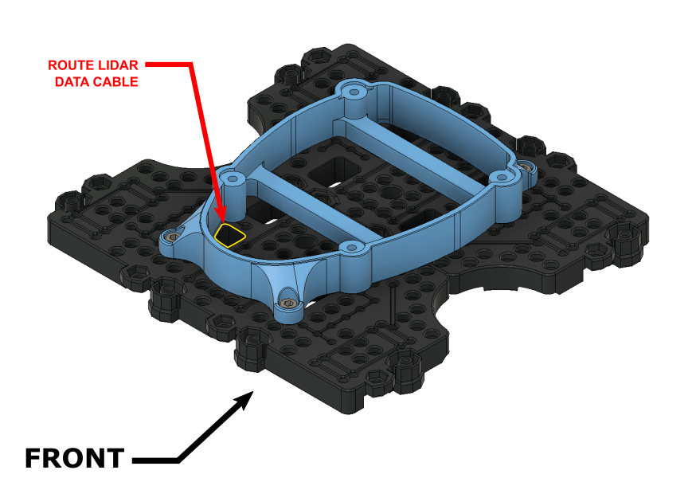
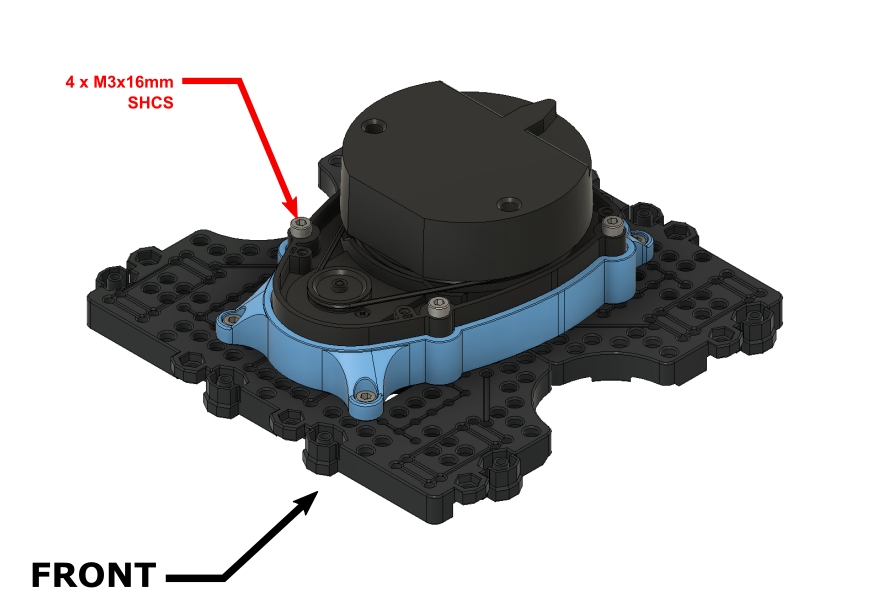
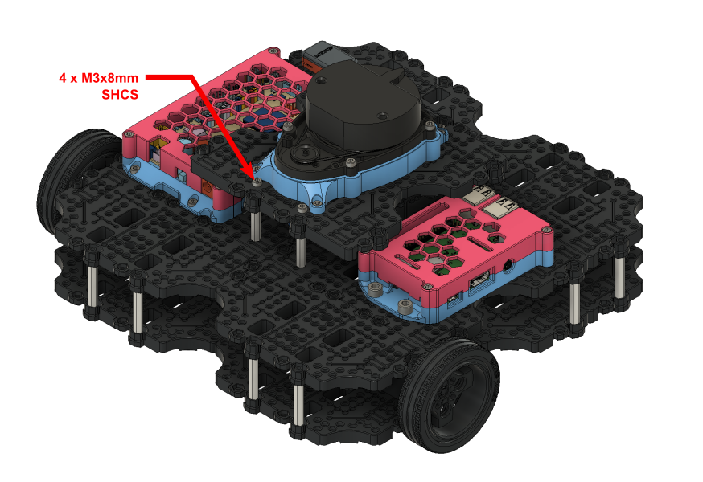
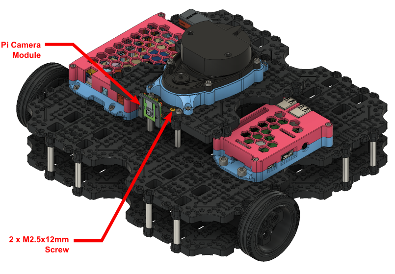
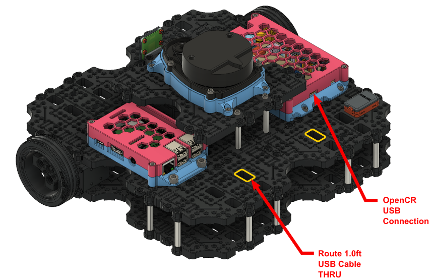

# LEONARDO - Turtlebot3 (Waffle Pi) Upgrade Kit

​	**A 3D printable, open-source upgrade kit for the Turtlebot3 Waffle Pi from Robotis.**

## **Kit Overview**

The Leonardo upgrade kit is intended to increase the overall modularity and usability of the Turtlebot3. This is a valuable upgrade for anyone looking to improve the physical user friendliness, durability and modularity of their Turtlebot3 unit. The following list outlines the key features of the Leonardo Kit.

####  **Kit Features:**

- **Enclosures:** Fully 3D printable enclosures for both the Turtlebot3's **Raspberry Pi** and **OpenCR** boards, with solid mounting points.
- **Solid LIDAR Mount:** A 3D printable solid mount for the LDS-01 LIDAR unit.
- **Improved User Experience** Careful consideration was made to relocate both the Raspberry Pi and OpenCR boards to make their ports more easily accessible. This combined with their solid mount points makes connecting peripherals and interfacing with the robot much easier than on the standard model.
- **Improved Modularity:** The Leonardo upgrade kit reimagines the construction of the Turtelbot3's waffle plate frame, allowing it to be segmented and customized without altering the original footprint or waffle plate pattern of the robot.  This feature allows access to the large amounts of free space within the Turtlebot3 frame so you can easily add your own modifications.

## **Repository Overview**

  This repository contains all of the files and instructions necessary to upgrade a standard Turtlebot3 Waffle Pi unit, as well as, all of the CAD documentation one would require to add their own features to this upgrade kit. The following list provides detail on each of the sub-folders within this directory and where to locate relevant information within them.

**Repository Folders:**

- **3D Printing Files:** This folder contains all of the necessary **STL** files for printing the upgrade kit's parts.
- **CAD Files:** Contained within this folder are the **Fusion 360** solid models for the Leonardo Kit assembly and each of its sub-assemblies.

## Bill of Materials

The following table outlines all of the required items to complete the Leonardo upgrade:

| Item/Description                           | Qty. |                                              |
| :----------------------------------------- | :--: | :------------------------------------------: |
| Turtlebot 3 Waffle Pi Kit                  |  1   |      |
| 0.5 ft. Micro USB Cable                    |  1   |  |
| 1 ft. Micro USB Cable                      |  1   |   |
| **M3-0.5 x 8mm** - Socket Head Cap Screw   |  16  |         |
| **M3-0.5 x 16mm** - Socket Head Cap Screw  |  12  |         |
| **M5-0.8 x 8mm** - Socket Head Cap Screw   |  4   |         |
| **M3-0.5 x 6mm** - Pan Head Screw (NYLON)  |  8   |   |
| **M3-0.5 x 12mm** - Pan Head Screw (NYLON) |  2   |   |

# **Assembly Instructions**

​	This section outlines the assembly instructions for the Leonardo Upgrade Kit. These instructions assume that you have purchased all items in the **Bill of Materials** section and have 3D printed all relevant upgrade parts in accordance with the instructions laid out in the readme of the **3D Printing Files** folder.

------

### Step 1: TB3 First Layer Assembly

------

The Leonardo upgrade kit uses the **"First Layer Assembly"** from the standard Turtlebot3 Waffle Pi. Specific instructions for assembling the **"First Layer Assembly"** can be found on **Pages 16-20** of the Robotis Turtlebot3 Waffle Pi Assembly Manual. Once assembled, the First Layer Assembly can be set aside until **Step 4**

**Robotis Assembly Manual (Direct Download):** https://www.robotis.com/service/download.php?no=750

------

### Step 2: TB3 Second Layer Assembly

------

The Leonardo upgrade kit also uses the **"Second Layer Assembly"** from the standard Turtlebot3 Waffle Pi. Assembly instructions for the **"Second Layer Assembly"** can be found on **Pages 12-13** of the Robotis Turtlebot3 Waffle Pi Assembly Manual.  A fully assembled Second Layer is required before proceeding to **Step 3.**

------

### Step 3: Second Layer Drill & Tap Locations (Enclosure Mounting)

------

In order to attach the Raspberry Pi and OpenCR board enclosures, **6 pre-existing** holes must be modified and **2 new** holes must be added on the Second Layer Assembly.  

The **Step 3** image above indicates the relevant hole locations as well as their respective drill and tap sizes. The hole locations marked with **PINK** indicate where a new hole must be drilled. The location distances for the new holes are denoted on the image above, however, if one wishes to avoid measuring, the 3D printed lower case of the OpenCR board enclosure can be used as a template to transfer the hole locations to the waffle plate before drilling.

**NOTE:** Orientation of the second layer assembly matters from this step onwards. Be sure to follow the orientation indicators for each subsequent step.

------

### Step 4: Second/Third Layer Standoff Installation

------

The third layer of the Leonardo upgrade kit is supported by **4 - M3x35mm Standoffs** attached to the second layer assembly. These standoffs are re-purposed hardware from the standard Turtlebot3 kit and can be obtained from such.

The Step 4 image above indicates the correct installation location of each standoff, before installation the indicated holes must be  drilled out for an M3 free fit (3.15mm or 1/8" Drill).

**NOTE:** Ensure mounting screws for the standoffs are tightly secured and in the correct positions before proceeding. Once the second layer assembly is attached to the first, you will loose convenient access to the screw heads for these standoffs.

------

### Step 5: Second Layer Attachment + Cable Routing

------

At this stage the **Second Layer Assembly** created in **Step 2** can be attached to the **First Layer Assembly** created in **Step 1**. However, before attachment, the **Dynamixel Motor Cables** and the **Li-Po Battery Extension Cable** from the first layer must be correctly routed through the bottom of the Second Layer Assembly. The **Step 4** image above shows the respective routing locations for the cables. 

A total of **12 - M3x8mm** screws will be required to attach the second layer to the first. Socket head cap screws can be used if you wish, or you can repurpose the Philips head hardware of the same size from the original Turtlebot3 kit. 

------

### Step 6: OpenCR + Raspberry Pi Installation 

------

The **OpenCR** board and **Raspberry Pi**  can now be installed into their respective enclosure halves using **8 - M3x6mm Nylon Screws**. Once installed the enclosures can be attached to the **Second Layer Assembly** using the drilled and tapped holes created in **Step 2** of these instructions. The **Step 5** image above shows the required mounting hardware and respective installation locations.

**NOTE:** The mounting holes on the Raspberry Pi board may need to be enlarged for the M3 Nylon Screws if you have a brand new board. A 3.15mm or (1/8") drill bit will suffice for this process.

------

### Step 7: OpenCR Board Connections + Bluetooth Module Installation (BT-410)

------

- [ ] Attach the **Dynamixel Motor** cables and **Li-Po Battery Extension** cable that were routed during **Step 5** to the OpenCR board. The connection points are indicated by the **Green** and **Blue** arrowed text in the image above. 

  **NOTE:** Ensure correct connection of the Dynamixel motors by following the motor ID legend in the **GREEN** arrowed text. The motor IDs are indicated below each wheel for quick reference.

  

- [ ] Once the motor and battery connections are made, attach the **BT-410 Bluetooth Module** to the second layer assembly. The **RED** arrowed text above indicates its installation location as well as connection point on the OpenCR board.

  **NOTE:** The opening highlighted by the **RED** rectangle can be used to neatly tuck away the excess cable from the Bluetooth module.

  

- [ ] **OPTIONAL:** If you wish to use the standard Raspberry Pi camera that comes with the Turtlebot3 kit, now is the easiest time to connect the camera's ribbon cable. The **ORANGE** arrowed text above indicates its connection point.

  **NOTE:** It is easy to connect the camera cable backwards, ensure that the camera ribbon cable is connected in the correct orientation (Contacts on the ribbon cable facing the contacts on the port.)

------

### Step 8: Enclosure Assembly + Raspberry Pi Power Connection

------

- [ ] The top halves of the enclosure cases can now be attached to the assembly. As indicated in the assembly image above, a total of **8 - M3x16mm** fasteners will be required. If you are using a R-Pi camera, be sure to route the ribbon cable through the pass through opening indicated above by the **YELLOW** arrowed text.

- [ ] Once the enclosure cases are securely installed the 5V power connection between the OpenCR board and the Raspberry Pi board can be made. This is done using the **Raspberry Pi 3 Power Cable** from the standard Turtlebot3 kit.  The **GREEN** arrowed text in the image above indicates the connection points.

  

  **NOTE:** When connecting the power cable to the Raspberry Pi it is important to connect to the correct GPIO pins. Ensure that the **Positive** lead connects to **Pin 4** and the **Negative** lead connects to **Pin 6**. 

  (Refer to **Page 23** of the Turtlebot3 Waffle Pi Assembly Manual for connection information.)

------

### Step 9:  Third Layer Assembly + Tap & Drill Instructions

------

The third layer of the Leonardo upgrade requires only two waffle plates from the standard Turtlebot3 kit. The **Step 9** image above shows the manner in which the plates are connected and, indicates the fastener installation locations.

**NOTE:** It is important to leave the two M3 fastener locations indicated in the image above empty. These locations are used for attaching the USB2LDS driver board in the next step.

Once the waffle plates are assembled, and, before proceeding to the next step, a total of **4** pre-existing holes on the assembly must be modified. The **GREEN**  arrowed text in the **Step 9** image above indicates the relevant holes, as well, their respective drill and tap information.

------

### Step 10:  USB2LDS Module Installation

------

The USB2LDS module from the standard Turtlebot3 kit can now be installed on the underside of the the third layer assembly.  The module requires **2 - M3x12mm Nylon screws** that are fastened through the waffle plates in the fastener locations left empty in **Step 9**. As indicated in the image above the assembly also requires the **"Adapter Plate"** component from the standard Turtlebot3 kit, this component acts as a spacer for the module.

**NOTE:** The Nylon screws will protrude through the topside of the waffle plates. Use a pair of **flush-cut pliers** to trim the excess after the module has been tightly secured.

------

### Step 11:  LIDAR Mounting Bracket Installation

------

Turn the Layer 3 assembly back over and attach the LIDAR mount bracket to the top side using **4 - M3x8mm Socket Screws**.  The LIDAR bracket's mounting position corresponds with the 4 drilled and tapped holes made previously in **Step 9**.

------

### Step 12:  LIDAR Module Installation (LDS-01)

------

------

See the **NOTE** below before proceeding. Attach the LDS-01 LIDAR unit from the standard Turltbot3 kit to the mounting bracket using **4 - M3x16mm Socket Screws**. Be sure to route the unit's data cable though the opening highlighted in **YELLOW** in the image above before fastening. Once fastened make sure to attach the LDS-01's data cable to the USB2LDS module on the underside of the layer.

**NOTE:** The LIDAR unit's mounting holes will have to be modified to accept M3 sized fasteners. Drill out the 4 indicated mounting holes using a 3.15mm or (1/8") drill bit.

------

### Step 13:  Third Layer Attachment

------

Attach the third layer assembly to the standoffs that were previously installed on the second layer assembly during **Step 4**. This will require **4 - M3x8mm Socket Screws**.

------

### Step 14:  Pi Camera Module Installation (Optional)

------

If you plan on using the standard Pi Camera module that comes with the Turltbot3 kit, it can now be easily attached to the **Third Layer Assembly ** using the standard M2.5x12mm mounting hardware that comes with it. 

**NOTE:** See page 30 of the Robotis Turtlebot3 Waffle Pi Assembly Manual for detailed instructions on assembling the Pi Camera module.

------

### Step 15: USB Connections and Cable Routing

------

The final steps are to make the USB connections to both the USB2LDS module and the OpenCR board from the Raspberry Pi unit.

- [ ] Connect the 0.5ft micro USB cable from the Raspberry Pi unit to the USB2LDS module beneath the third layer assembly
- [ ] Connect the 1.0ft micro USB cable from the Raspberry Pi unit to the OpenCR board.

**NOTE:** The 1.0ft micro USB cable should be routed through the holes highlighted in **YELLOW** on the way towards the OpenCR board, this will keep the cable routing tidy and out of the way during use.